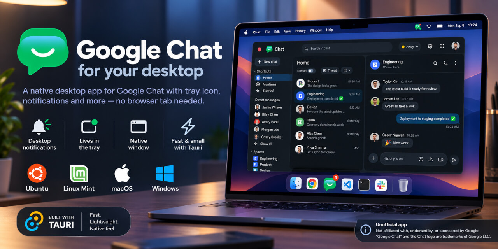

# Google Chat (Tauri)

<p align="center">
  
</p>

[](https://github.com/ankurk91/google-chat-tauri/actions/workflows/ci.yml)
[](https://github.com/ankurk91/google-chat-tauri/actions/workflows/release.yml)
[](https://github.com/ankurk91/google-chat-tauri/releases/latest)
[](https://somsubhra.github.io/github-release-stats/?username=ankurk91&repository=google-chat-tauri&page=1&per_page=30)
[](https://v2.tauri.app)
[](LICENSE.txt)

An unofficial desktop app for [Google Chat](https://chat.google.com) on Linux, macOS and Windows.

It puts Chat in a real window with a tray icon, an unread indicator and native desktop notifications, instead of a
browser tab that gets lost among the others.

Unlike an Electron app, it ships no browser of its own — it uses the web engine your system already has. That is why the
Linux `.deb` is ~3 MB, where the [Electron version of this app](https://github.com/ankurk91/google-chat-electron), no
longer maintained, was 66 MB.

> Not affiliated with, endorsed by, or sponsored by Google. "Google Chat" and
> the Chat logo are trademarks of Google LLC.

## Features

- **Unread indicator** — a dot on the tray icon, the count in the window title, and a badge on the macOS dock or Windows
  taskbar.
- **Desktop notifications** — with sound. On Linux, clicking one brings the window back.
- **Lives in the tray** — closing the window hides it rather than quitting; the app keeps running and keeps notifying.
- **Remembers your window** — size, position and maximised state come back where you left them.
- **One instance** — launching again focuses the window you already have.
- **Menu bar** — File, Edit, View, History, Preferences and Help, with zoom that persists between launches.
- **Starts how you like** — optionally launch at login, and start hidden in the tray on any launch rather than opening a
  window. Both under **Preferences**.
- **Keyboard shortcuts** — `Ctrl+F` to search, `Ctrl` `+`/`-`/`0` to zoom,
  `Alt+←`/`Alt+→` to go back and forward, `Alt+Home` to return to Chat, `Ctrl+W` to hide to the tray.
- **Links open in your browser** — a Docs, Sheets, Drive or Calendar link someone shares opens in your real browser,
  with your extensions and your other tabs. Only Chat itself stays in this window.
- **Attachments download through your browser** — clicking one hands the link to your browser, which saves it the way it
  saves anything else. Files the window fetches itself, such as **Save image as** from the right-click menu, go straight
  to your Downloads folder.
- **Signs in normally** — a personal Google account and a paid Google Workspace one both work, in any country: the
  sign-in hop through your local `accounts.google.*` domain stays inside the window instead of stranding you on a login
  page. **File → Sign Out** ends the session without touching your browser's, and signing back in afterwards does not
  need the app's data wiped first.
- **Waits out a missing network** — with no connection at startup, a notification tells you and the window shows a
  readable page with a **Try again** button, rather than the web engine's own unstyled error. It keeps watching, so Chat
  loads by itself within half a minute of the connection coming back.
- **A way back from a wedged session** — **Help → Reset App Data** signs you out, returns every preference to its
  default and restarts the app clean. **Show Logs** and **Report an Issue** are next to it.

The app does not collect analytics and does not update itself. It does ask GitHub twice a day whether a newer
release exists, and tells you if there is one — you download and install it yourself. That can be turned off in
**Preferences**.

**Sign-in that leaves Google** — an external identity provider, or SSO through Okta, Entra ID, Ping and the like —
redirects to a host belonging to your organisation. The app cannot know that address ahead of time, so it is not on the
short list of hosts allowed to stay in the window, and a link out to it would otherwise open in your browser and finish
the sign-in there. **Preferences → Temporarily Open Every Link in This Window** suspends that for five minutes, which is
long enough to get through the flow. It explains itself before it does anything, and switches itself off again
afterwards.

## Supported systems

| OS      | Version                                                  | Architecture                        | Download            |
|---------|----------------------------------------------------------|-------------------------------------|---------------------|
| Linux   | glibc 2.39+ — Ubuntu 24.04, Mint 22, Debian 13 and newer | x86_64                              | `.deb`, `.AppImage` |
| macOS   | 15 Sequoia and newer                                     | Apple silicon and Intel (universal) | `.dmg`              |
| Windows | 10 (1803+) and 11                                        | x64                                 | `.exe` installer    |

Nothing is built for 32-bit, ARM Linux, or Apple silicon separately from the universal build. Windows needs the WebView2
runtime, which is part of Windows 11 and is installed automatically by the installer on older systems.

The Linux bundles are built on Ubuntu 24.04, which sets the glibc floor; a binary built there runs on newer
distributions but not older ones, so 22.04 and Mint 21 are not supported.

A couple of small things behave differently depending on your desktop — see
[docs/Troubleshooting.md](docs/Troubleshooting.md) before filing a bug.

## Install

Everything below comes from the [latest release](https://github.com/ankurk91/google-chat-tauri/releases).

### Linux — `.deb` (Debian, Ubuntu, Linux Mint)

```bash
sudo apt install ./google-chat-tauri_*_linux-amd64.deb
```

The leading `./` matters — without a path, `apt` looks for a package by that name in your repositories. Installing this
way pulls in the dependencies (`libwebkit2gtk-4.1-0`, `libgtk-3-0`, `libayatana-appindicator3-1` and OpenSSL) in the
same step; they come from your distribution and are usually installed already.

Then launch **Google Chat** from your applications menu.

**Uninstall.**

```bash
sudo apt purge google-chat
```

### Linux — `.AppImage` (any distribution)

An alternative if you would rather not install anything, or your distribution is not Debian-based. It is much larger
than the `.deb`, because it carries its own copy of the web engine instead of using the one your system already has:

```bash
chmod +x google-chat-tauri_*_linux-amd64.AppImage
./google-chat-tauri_*_linux-amd64.AppImage
```

**Uninstall.** Nothing was installed, so delete the file and the data it wrote:

```bash
rm -rf google-chat-tauri_*_linux-amd64.AppImage \
  ~/.local/share/com.ankurk91.google-chat-tauri \
  ~/.config/com.ankurk91.google-chat-tauri \
  ~/.cache/com.ankurk91.google-chat-tauri \
  ~/.config/autostart/'Google Chat.desktop'
```

AppImageLauncher and `appimaged` add a menu entry of their own under `~/.local/share/applications/`; remove that too.

### macOS — `.dmg`

The dmg is universal — Apple Silicon and Intel. Drag **Google Chat** into **Applications**.

The build is unsigned, so the first launch is blocked and the dialog offers to move the app to the Bin. Do not:

1. Click **Done**.
2. Open **System Settings → Privacy & Security**.
3. Scroll to **Security**, where a line names Google Chat as blocked.
4. Click **Open Anyway** and confirm with your password or Touch ID.

Every launch after that is normal.

**Uninstall.** Drag the app out of **Applications**.

### Windows — `.exe` installer

The build is unsigned, so SmartScreen blocks the first launch: click **More info**, then **Run anyway**. Every launch
after that is normal.

**Uninstall.** Use **Add or remove programs**.

## Troubleshooting

Blank window, missing notifications, sign-in trouble: see
[docs/Troubleshooting.md](docs/Troubleshooting.md). **Help → Show Logs** opens the log folder, and **Help → Report an
Issue** opens a new issue with your version, platform and web engine already filled in.

## Contributing

See [docs/Development.md](docs/Development.md) for how to build and run it.

## How this was built

Vibe-coded with [Claude](https://claude.com/claude-code), which wrote the Rust, the JavaScript and these docs. A human
reviewed every line before it landed and tested the result on real hardware — which is where the platform quirks
recorded in [docs/Notes.md](docs/Notes.md) came from, since none of them are the sort of thing a model finds by reading
documentation. [docs/Workarounds.md](docs/Workarounds.md) is what the code does about them.

## Licence

[GPL-3.0-only](LICENSE.txt).
